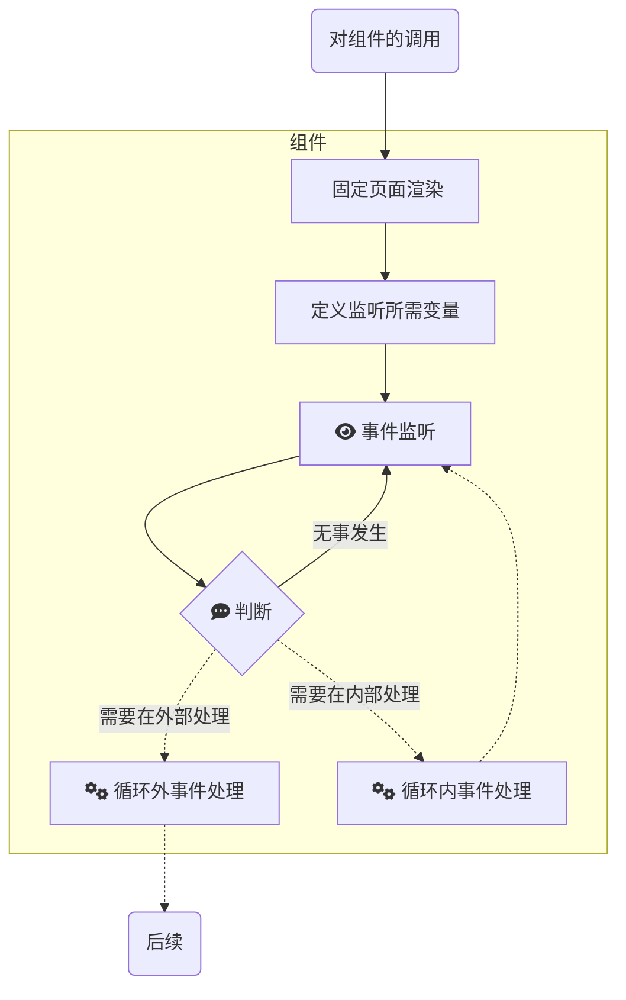

如果你对 coding 感兴趣，并曾经学习过一些现代语言的工程项目，“模块化、组件化、工程化”的概念一定不陌生。本文主要就模块化与组件化对BC开发进行一些个人向启发式的编码风格推荐。

## 组件化
在开始编码前，请将你需要实现的功能划分好层级关系。这将更便于你结构清晰地进行开发，让自己的思路始终流畅。

由于BC不支持多线程（至少在我的认知中不可以），项目中，我们只需要处理当前选中（focused）的部分，因而，可以将整个项目分成多个组件，一次处理一个组件。


## 模块化
### 对于每个组件

而在BC开发中，前后端是统一的，前端页面也是硬编码形成的。不过为了让结构更加清晰，我们也可以借用一般C/S架构开发的经验。

在前端语言中，展示与交互是同时在页面上体现，而相互关联的。显然，在BC中监听鼠标、键盘等输入时，需要一个循环体，持续对输入进行监测、判断和处理。让我们使用前端开发的思路写一个页面，大致框架如下。

```c
void home(){
    while(1){
        //绘图
        setfillstyle(1,WHITE);
        bar(0, 0, 1023, 767);
        setfillstyle(1,BLACK);
        bar(300, 300, 500, 500);
        //事件监听
        int x, y, c;
        newmouse(&x, &y, &c);
        int k = 0;
        if(bioskey(1)){
            k = bioskey(0);
        }
        //事件处理
        if(c || k && k != ESCAPE){
            login();
        }
        if(k == ESCAPE){
            return;
        }

    }
}

```
运行发现，鼠标键盘功能正常，但是会出现闪烁。

如果将固定页面的渲染与监听事件放在同一个函数中，并放在循环体中，就会出现问题。因为页面的渲染存在先后覆盖的关系，在运行过程中则会交替闪烁，无法达到预期要求。即使在渲染完成后加入延时，由于每一次循环所绘制的帧中不同组件的绘图不是在同一瞬间内完成的，因而还是会出现闪烁的情况。

我们发现，每个组件内可以分为固定界面渲染、事件监听和事件处理三部分。

因此，我的解决方案是将固定页面的渲染和事件监听分成两个函数，页面渲染放在组件被创建的最初位置，将事件监听放入循环体内，并与组件通信，判断是否需要处理，并分两种处理方式处理。具体流程如下。



在这种情况下，实现了类似“前后端分离”的效果。

### 对于复用率高的组件
